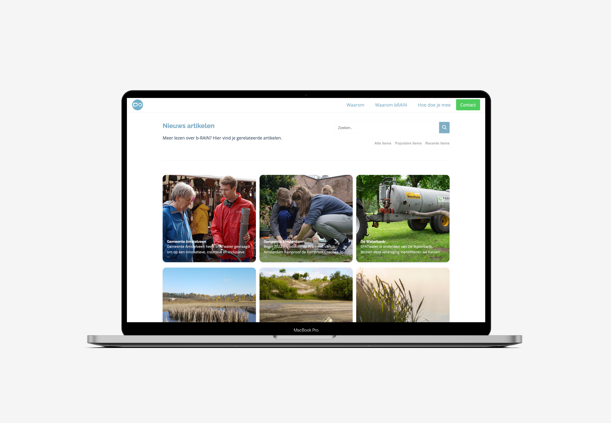

> _Fork_ deze leertaak en ga aan de slag. 
Onderstaande outline ga je gedurende deze taak in jouw eigen GitHub omgeving uitwerken. 
De instructie vind je in: [docs/INSTRUCTIONS.md](docs/INSTRUCTIONS.md)

# Titel
<!-- Geef je project een titel en schrijf in één zin wat het is -->
bRAIN Nieuws artikelen 

## User Story
<!-- Schrijf de user story waar je aan hebt gewerkt  -->
Als 'klant of potentiële investeerder' wil ik 'een artikel kunnen terug vinden' zodat 'ik specifieke informatie kan vinden en mij beter kan verdiepen in het onderwerp'

## Beschrijving
<!-- In de Beschrijving staat hoe je project er uit ziet, hoe het werkt en wat je er mee kan. -->
<!-- Voeg een mooie poster visual toe 📸 -->

<a href="https://lmikkers.github.io/fix-the-flow-interactive-website">https://lmikkers.github.io/fix-the-flow-interactive-website</a>
<!-- Voeg een link toe naar Github Pages 🌐-->

## Kenmerken
<!-- Bij Kenmerken staat welke technieken zijn gebruikt en hoe. Wat is de HTML structuur? Wat zijn de belangrijkste dingen in CSS? Wat is er met JS gedaan en hoe? -->
### HTML, CSS en Javascript

## Licentie

This project is licensed under the terms of the [MIT license](./LICENSE).

